# GraphVerse: Advanced Graph Algorithm Platform

GraphVerse is a high-performance algorithmic suite built with **C++**, **Visual Studio 2026**, and **Qt**. It provides an interactive, detailed environment for visualizing graph theories and solving complex real-world optimization problems through a premium dark-themed interface.

---

## ⚡ Algorithm Visualizers (Detailed Implementation)

Each visualizer provides a step-by-step trace of the logic, with real-time performance metrics and state tracking.

### 1. Maze Explorer
- **Functionality**: Solves grid-based mazes using BFS and DFS algorithms, visualizing the frontier expansion during the search process. This module demonstrates the fundamental differences between exploration strategies in a controlled grid environment.

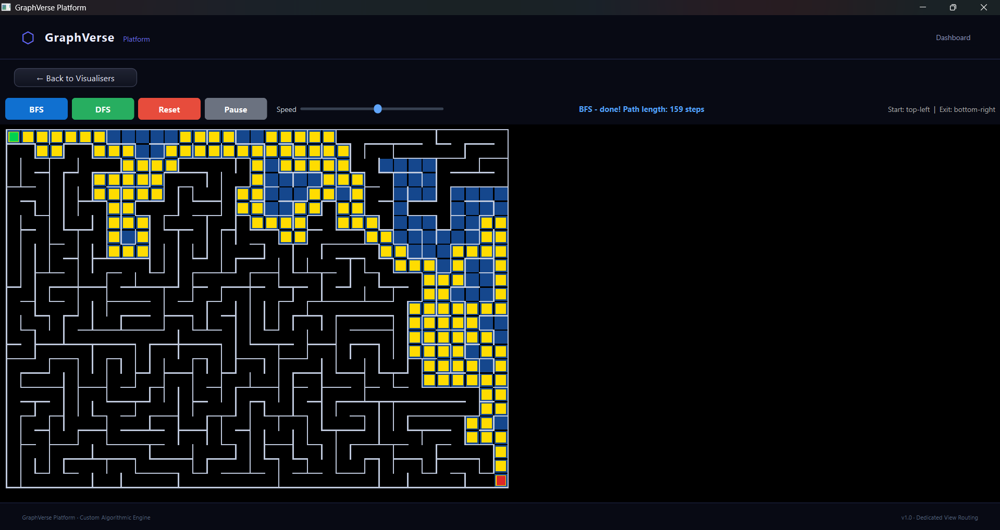
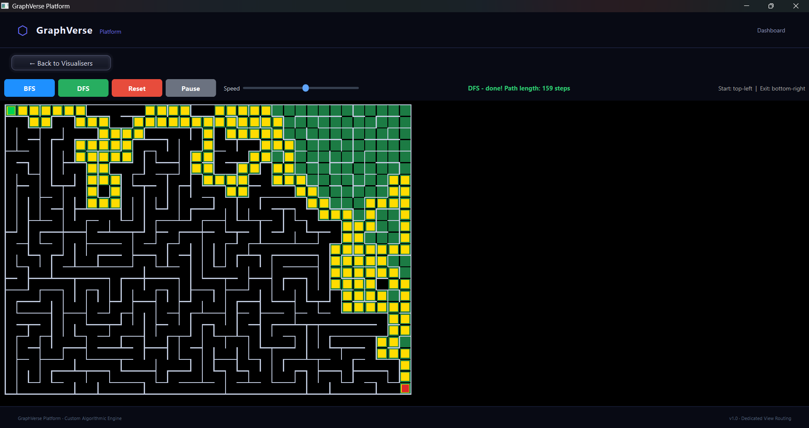

### 2. Shortest Path Algorithms
The engine implements these through a weighted adjacency list structure.
- **Dijkstra**: Uses a **Min-Priority Queue** (`std::priority_queue` with `std::greater`) to always expand the node with the smallest cumulative distance. Implementation includes **edge relaxation** where the distance to a neighbor is updated if a shorter path is found.
- **A***: Enhances Dijkstra with a **heuristic function**. The heuristic is calculated as the Euclidean distance to the target node, scaled by the global minimum weight/distance ratio found in the graph to ensure it remains **admissible**.
- **Bellman-Ford**: Performs **N-1 iterations** of edge relaxations over the entire edge set. In this implementation, it is used for pathfinding on graphs, ensuring correct handling of any arbitrary edge order.
- **Floyd-Warshall**: An all-pairs shortest path algorithm using a **Dynamic Programming** approach with a 2D distance matrix and a successor matrix for path reconstruction.

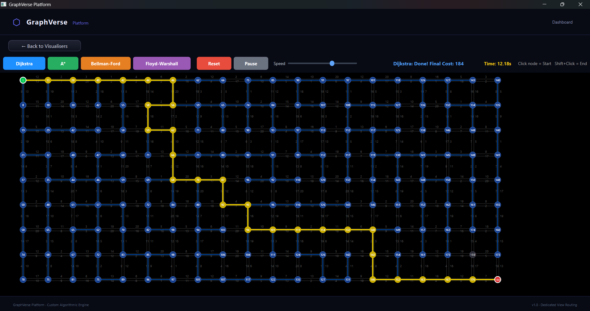

### 3. Spanning Trees (MST)
MST visualizers show the process of connecting all nodes with minimum total edge weight.
- **Kruskal**: Implemented by sorting the global edge list by weight. It uses a **Disjoint Set Union (DSU)** with **Path Compression** and **Rank Optimization** to detect cycles efficiently.
- **Prim**: Starts from a root node and uses a **Priority Queue** to track all edges connecting the current MST component to unvisited nodes.
- **Boruvka**: A multi-phase algorithm that finds the cheapest edge for **each connected component** simultaneously in each step. Components are merged using a DSU structure.

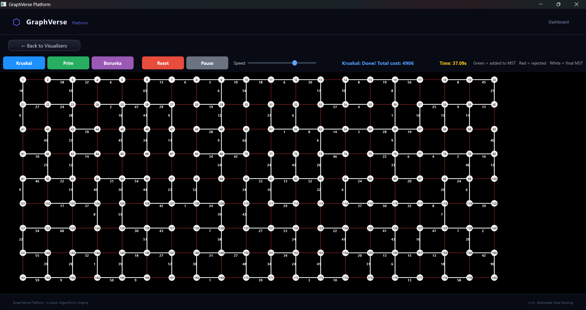

### 4. Network Flow & Cycle Logic
- **Edmonds-Karp (Max Flow)**: A specific implementation of Ford-Fulkerson that uses **BFS** to find the shortest augmenting path in the residual graph.
- **Min-Cut**: Identified by finding all nodes reachable from the Source in the final **residual graph**.
- **Negative Cycle Elimination**: Identifies negative cycles in the residual graph using a parent-tracking variant and saturates them via **Cycle Canceling**.

| Stage | Process | Results |
|-------|---------|---------|
| 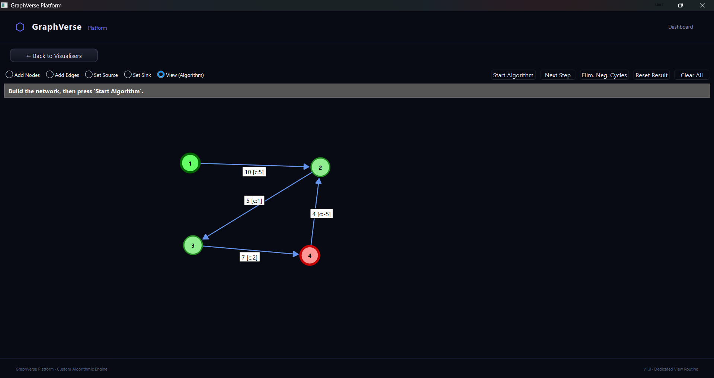 | 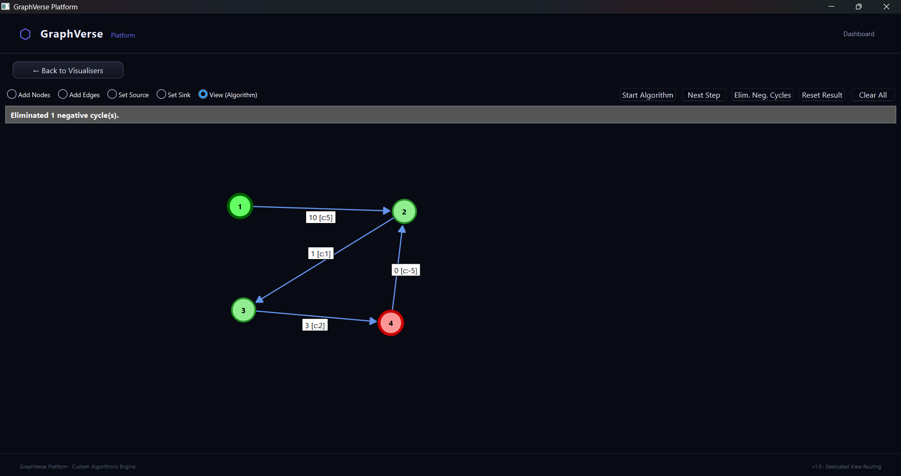 | 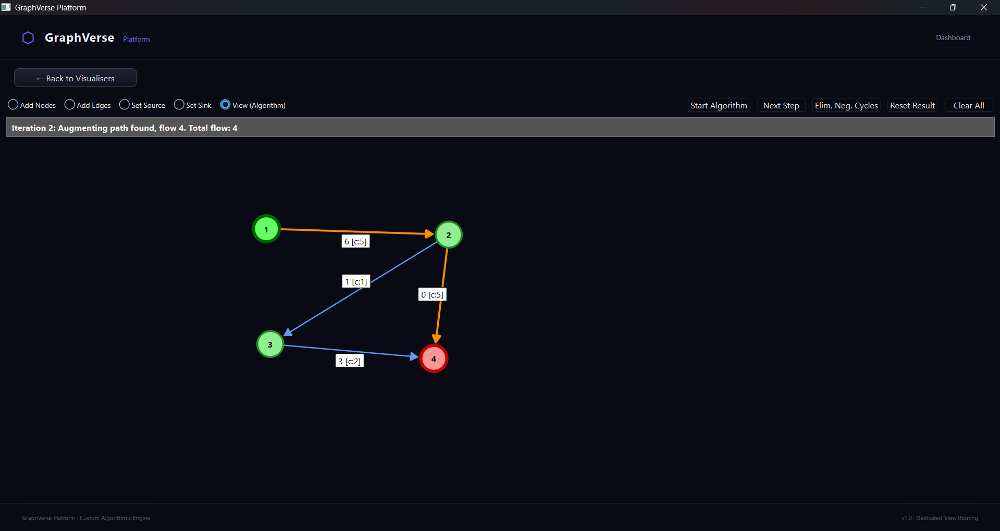 |
| 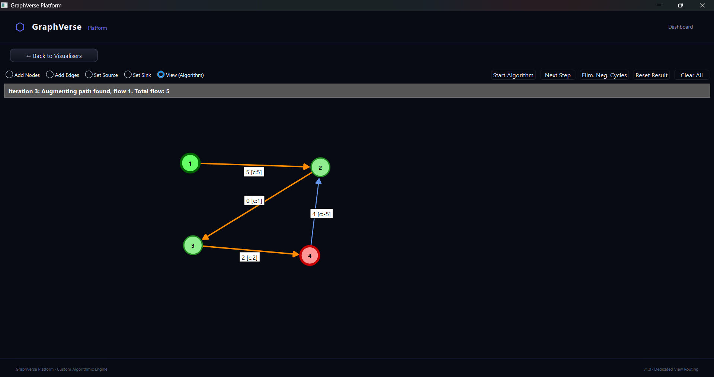 | 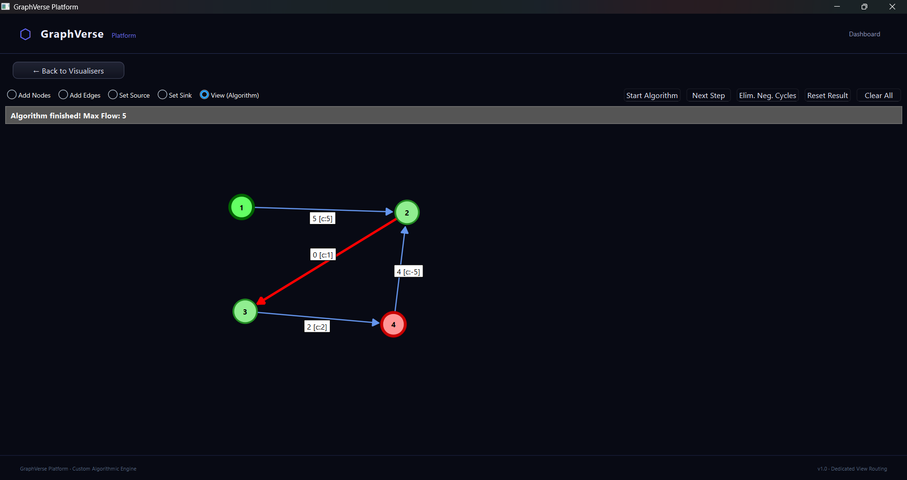 | |

### 5. Connectivity & Components
- **Strongly Connected Components (SCC)**: Implements **Kosaraju’s Algorithm** with two DFS passes (original and transpose graphs).
- **Condensed Graph View**: Collapses each SCC into a single "super-node", revealing the underlying **DAG** structure.

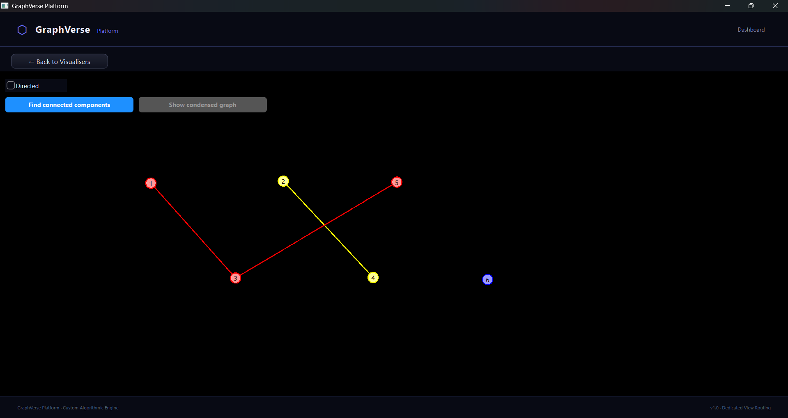
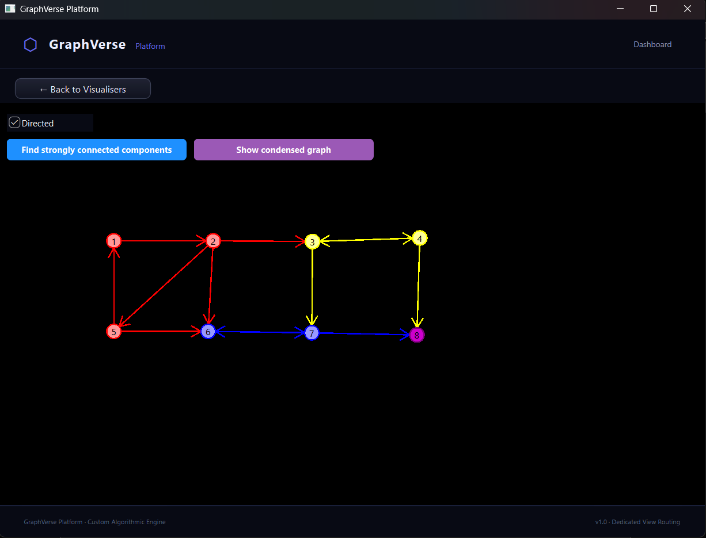
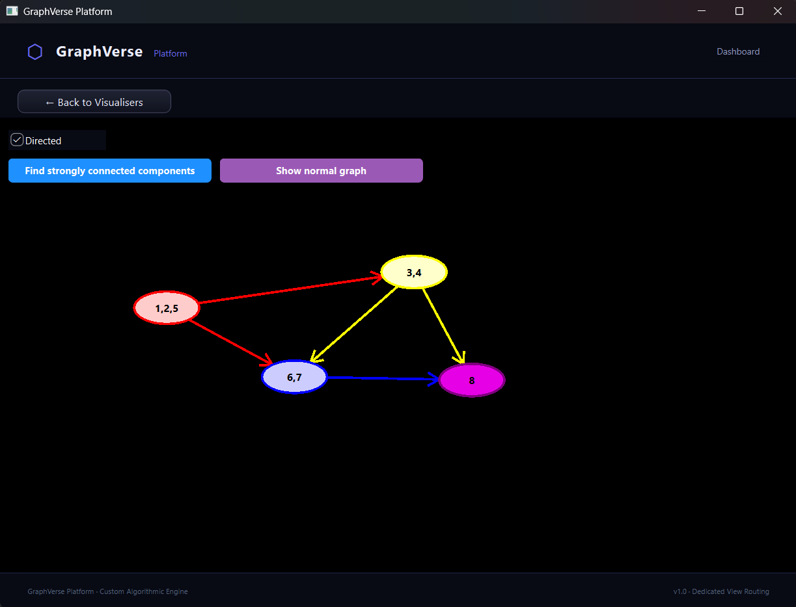

---

## 🌐 Real-World Applications (In-Depth)

GraphVerse translates abstract math into concrete logic for modern systems.

### 👥 Friend Suggestion System
- **Algorithm**: Breadth-First Search (BFS).
- **Implementation**: Traverses the social graph to find **2nd-degree neighbors**.
- **Ranking**: Suggestions are ranked by **Connection Density** (mutual friend count) between the root user and candidates.

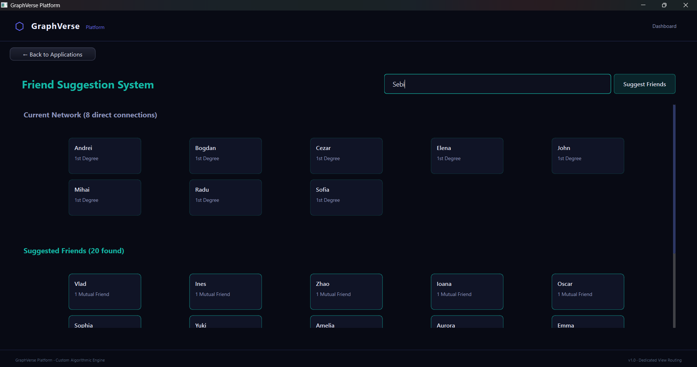

### 🌍 Translation Network
- **Algorithm**: Kruskal's MST + DFS.
- **Implementation**: Uses a `translations.json` dataset where languages are nodes and translation "difficulties" are edge weights.
- **Logic**: Identifies the **Minimum Spanning Tree** to find the most efficient global translation paths, then generates a hierarchy via **Directed DFS**.

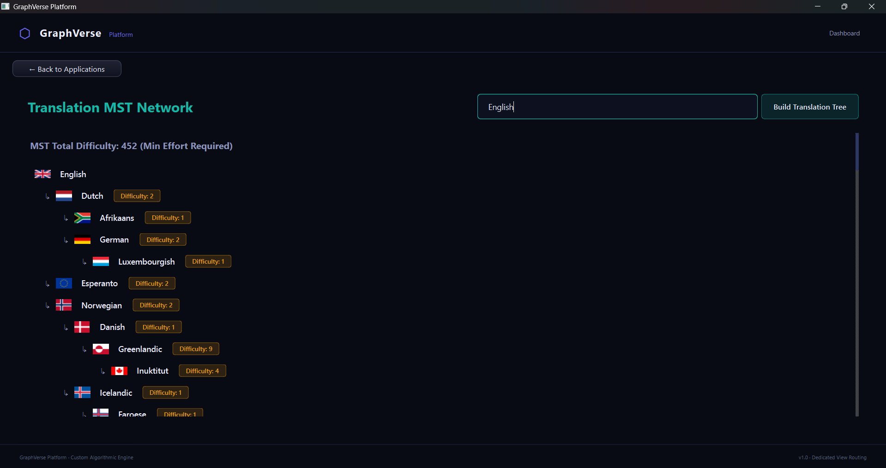

### 🛒 Supermarket Navigator
- **Algorithm**: Dijkstra's Shortest Path on a Constrained Geometry.
- **Implementation**: Includes a **node-clamping system** that restricts section movement to stay within the store floor plan boundaries.
- **Logic**: Dynamically recalculates edges based on proximity for real-time pathfinding.

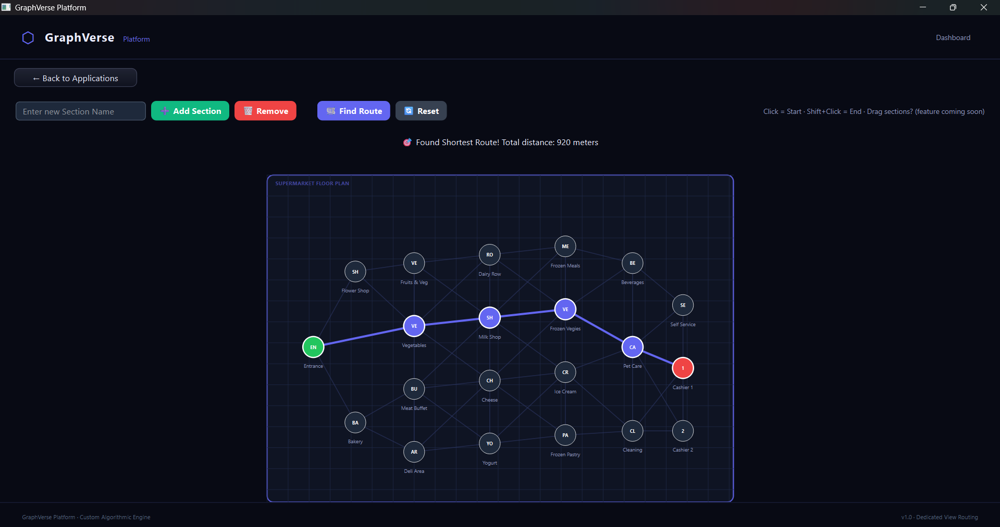

### 🚖 RideMatch (Passenger ↔ Driver Matching)
- **Problem**: Maximum Bipartite Matching solved via **Max Flow**.
- **Logic**: Creates a virtual flow network where edges exist only if Euclidean distance is within the user-defined **match radius**.

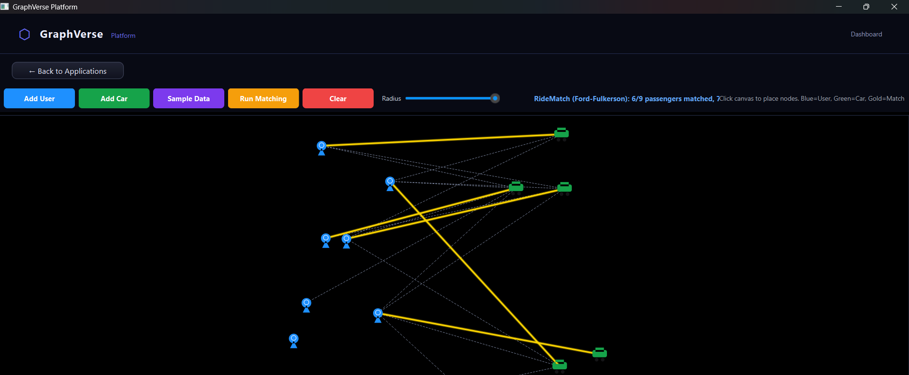

---

## 📚 Theoretical Applications

Classical problems demonstrating complex graph traversals and optimization.

### 1. Flood Fill Algorithm
- **Logic**: Uses a queue-based **BFS** to identify and traverse contiguous regions of the same "color" or state.
- **Visualisation**: Shows the "wave" expansion from the seed point across the grid.

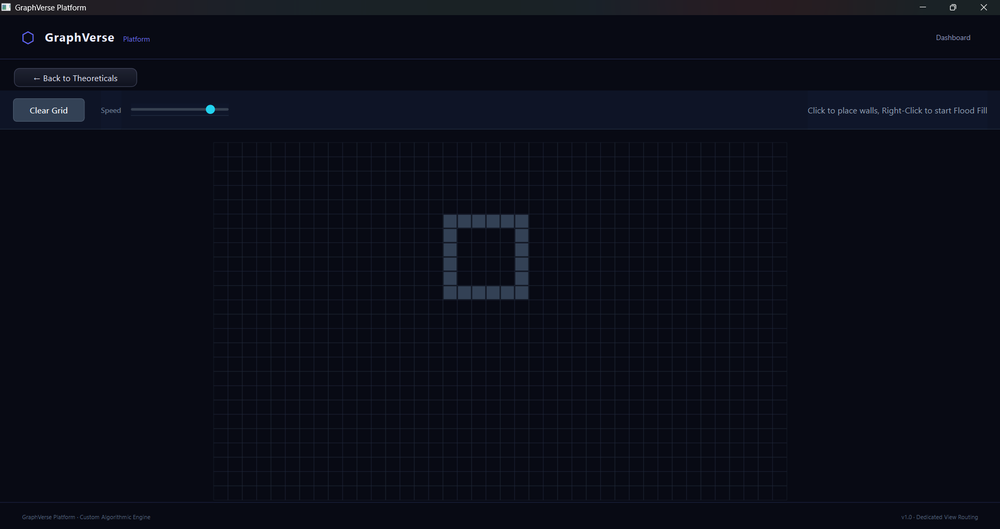

### 2. Traveling Salesman Problem (TSP) - Romania
- **Algorithms**: Floyd-Warshall + Kruskal's MST + DFS Approximation.
- **Logic**: Finds a near-optimal Hamiltonian circuit for a 15-city map of Romania.
- **Path**: First computes all-pairs shortest paths, generates a complete graph ($K_n$), finds the MST, and then performs a **Preorder DFS** traversal to generate the final circuit.

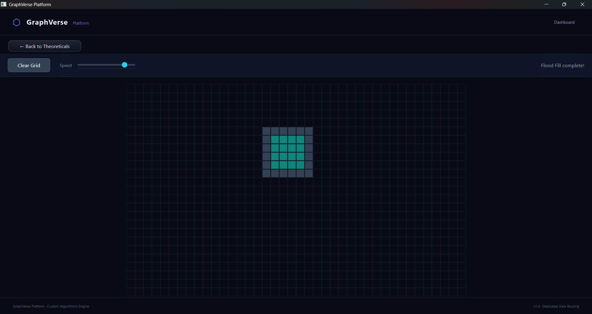

---

## 🖥️ User Interface & Experience

The platform features a modern, dashboard-driven design:
- **Main Dashboard**: Quick access to all modules with animated node-edge backgrounds.
- **Responsive Controls**: Speed sliders for animations, pause/resume functionality, and live status labels.

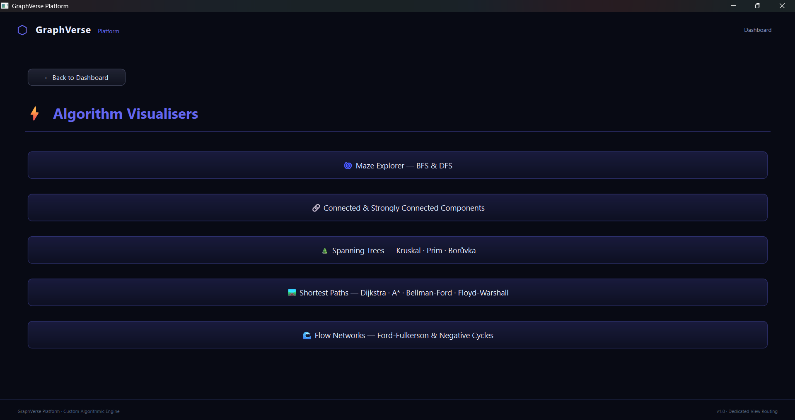
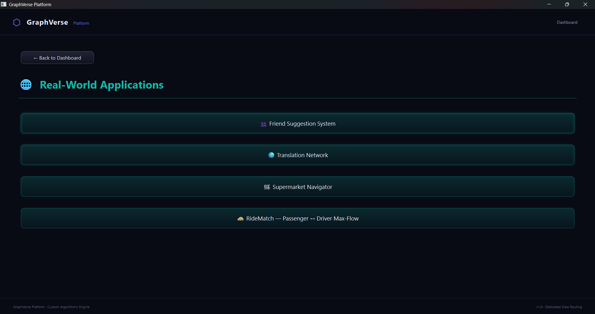
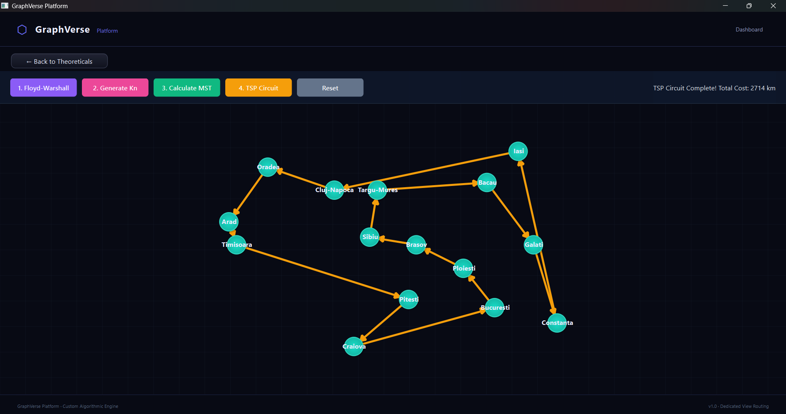

---

## 🛠️ Requirements & Build
- **Environment**: Visual Studio 2026.
- **Framework**: Qt 6.x (integrated via Qt VS Tools).
- **Resources**: Uses a custom JSON parser for translation data and `QPainter` for rendering.

*GraphVerse: Bridging the gap between theoretical graph theory and practical application.*
